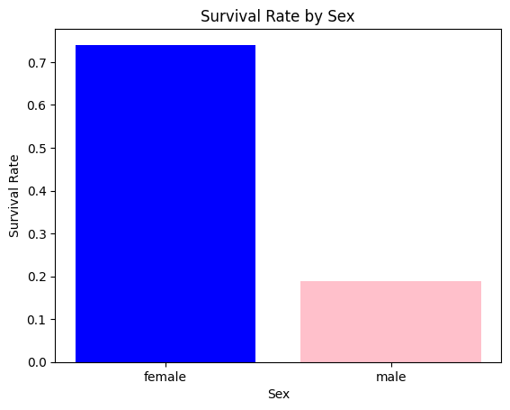
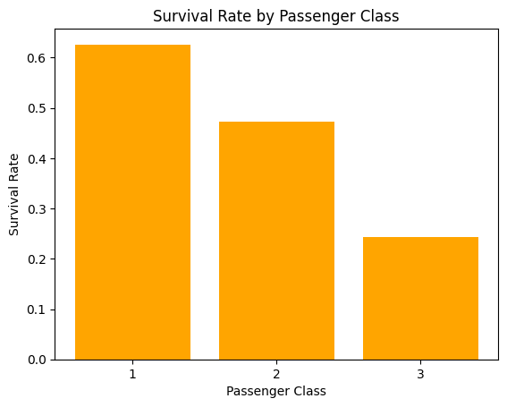
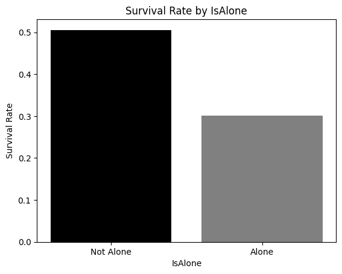
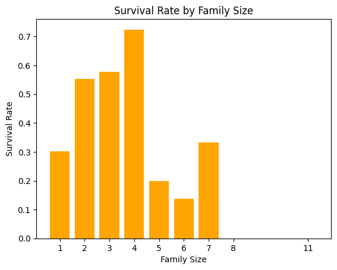

# Titanic Survival Prediction

A machine-learning pipeline to predict passenger survival on the Titanic. This project covers data ingestion, cleaning, feature engineering, modeling, evaluation, and a minimal API for inference.

---

## Table of Contents

1. [Project Overview](#project-overview)
2. [Directory Structure](#directory-structure)
3. [Getting Started](#getting-started)
4. [Data](#data)
5. [Data Analysis](#data-analysis)
6. [Feature Engineering & Preprocessing](#feature-engineering--preprocessing)
7. [Modeling](#modeling)
8. [Inference API](#inference-api)
9. [API Requests & Responses](#api-requests--responses)
10. [Utilities](#utilities)
11. [Screenshots](#screenshots)
12. [License](#license)

---

## Project Overview

We build a classifier to predict whether a passenger survived the Titanic disaster. The pipeline includes:

* Data cleaning & missing-value handling
* Feature engineering (e.g., family size, is alone)
* Encoding categorical variables
* Training a scikit-learn model (persisted as `titanic_model.pkl`)
* Automated evaluation on hold-out test set
* A minimal FastAPI service to serve predictions

---

## Directory Structure

```
.
├── .venv/                      # Python virtual environment
├── api/                        # FastAPI inference server
├── data/
│   ├── raw/                    # Original Kaggle CSVs
│   │   ├── gender_submission.csv
│   │   ├── test.csv
│   │   └── train.csv
│   └── processed/
│       └── train_processed.csv
├── data-analysis/              # Jupyter notebooks for EDA & analysis
│   └── train-data-analysis.ipynb
├── data-manipulation/          # Notebooks on cleaning & feature eng.
│   ├── 1-handling-missing-values.ipynb
│   └── 2-feature-engineering.ipynb
├── models/
│   └── titanic_model.pkl       # Serialized model
├── results/
│   └── test_results.md         # Evaluation metrics, confusion matrix
├── screenshots/                # EDA plots
│   ├── Survival-vs-Sex.png
│   ├── Survival-vs-Pclass.png
│   ├── Survival-vs-IsAlone.png
│   └── Survival-vs-Family-Size.png
├── src/
│   ├── utils/                  # Utility scripts
│   │   ├── add_family_features.py
│   │   ├── encode_categorical_variables.py
│   │   ├── load_model.py
│   │   ├── save_models.py
│   │   └── save_test_results.py
│   ├── config.py               # Paths & hyperparameters
│   ├── main.py                 # Orchestration entry point
│   ├── train.py                # Training script
│   └── test.py                 # Evaluation script
├── .gitignore
├── README.md                   # ← you are here
└── requirements.txt
```

---

## Getting Started

### Requirements

* Python 3.8+
* pip

### Installation

1. **Clone the repo**:

   ```bash
   git clone https://github.com/your-username/titanic-prediction.git
   cd titanic-prediction
   ```
2. **Create & activate a virtual environment**:

   ```bash
   python -m venv .venv
   source .venv/bin/activate   # Linux/macOS
   .venv\Scripts\activate    # Windows
   ```
3. **Install dependencies**:

   ```bash
   pip install -r requirements.txt
   ```

---

## Data

### Raw Data

* `data/raw/train.csv` – Training labels & features
* `data/raw/test.csv` – Hold-out set for final submission
* `data/raw/gender_submission.csv` – Kaggle’s example submission

### Processed Data

* After cleaning & feature engineering, the processed training set lives in:

  ```
  data/processed/train_processed.csv
  ```

---

## Data Analysis

This section covers exploratory analysis performed on the training data. Use the Jupyter notebook `data-analysis/train-data-analysis.ipynb` to generate and review the following:

  <div style="
  display: grid;
  grid-template-columns: 1fr 1fr;
  grid-template-rows: 1fr 1fr;
  gap: 4px;
  width: 300px;
  height: 300px;
  border: 2px solid #4285f4;
">
  
  
  
  
</div>

Feel free to add additional graphs or insights here as needed.

---

## Feature Engineering & Preprocessing

* Missing-value handling: `data-manipulation/1-handling-missing-values.ipynb`
* New features: family size, is alone, title extraction, etc.: `data-manipulation/2-feature-engineering.ipynb`
* Encoding & scaling performed via utility scripts in `src/utils/`

---

## Modeling

### Training

```bash
python src/train.py
```

This will:

1. Load `data/processed/train_processed.csv`
2. Fit a classifier (e.g., RandomForest / XGBoost)
3. Serialize model to `models/titanic_model.pkl`

### Evaluation & Results

```bash
python src/test.py
```

Results (accuracy, precision, recall, confusion matrix) are saved to `results/test_results.md`.

---

## Inference API

A simple FastAPI service lives in `api/`. To launch:

```bash
cd api
uvicorn main:app --reload
```

* **Endpoint**: `POST /predict`
* **Input**: JSON payload with passenger features
* **Output**: `{ "survived": 0|1, "probability": float }`

---

## API Requests & Responses

### Example Request (cURL)

```bash
curl -X POST \
  http://localhost:8000/predict \
  -H "Content-Type: application/json" \
  -d '{
    "Pclass": 3,
    "Sex": "male",
    "Age": 22,
    "SibSp": 1,
    "Parch": 0,
    "Fare": 7.25,
    "Embarked": "S",
    "Title": "Mr",
    "FamilySize": 2,
    "IsAlone": 0
}'
```

### Example Response

```json
{
  "survived": 0,
  "probability": 0.15
}
```

Include more request/response examples as you expand the API.

---

## Utilities

* **`add_family_features.py`** – Compute `FamilySize`, `IsAlone`
* **`encode_categorical_variables.py`** – One-hot / Label encode
* **`load_model.py`** – Load serialized model
* **`save_models.py`** – Helpers to persist models
* **`save_test_results.py`** – Write evaluation summary

---

## Screenshots


---

## License

This project is released under the MIT License.
